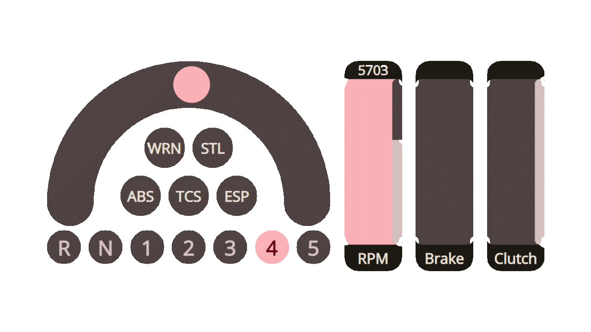

# AORC Reference Controller

#### Discord

## Info

**For more information on controller development, please refer to
the [according section in the client's documentation](https://github.com/Theaninova/aorc-client#controller-development)**

This is a simple reference implementation of the AORC controller with little styling applied.

## OBS Overlays

### Advanced HUD

Add a browser source, then add this URL:

[https://github.com/Theaninova/aorc-server/advanced-hud](https://github.com/Theaninova/aorc-server/advanced-hud)

*Note: You still need the [client mod](https://github.com/Theaninova/aorc-server) and the
[server](https://github.com/Theaninova/aorc-server) running to use this overlay.*

